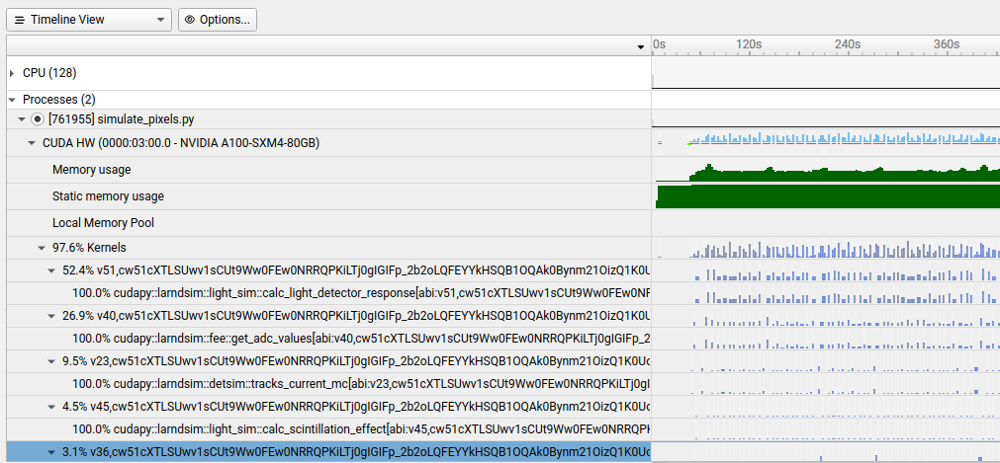

# larnd-sim example

This is a minimal example for running and profiling [larnd-sim](https://github.com/DUNE/larnd-sim) (and associated miniapps) on Perlmutter at NERSC.

## Installation

Note: CFS and `$HOME` tend to struggle with Python virtual environments, so I recommend that you do the following steps in a directory on `$PSCRATCH` (but commit/push any code changes that you don't want to fall victim to `$PSCRATCH`'s purge policy!).

Start by cloning and entering this repository:

``` bash
git clone https://github.com/lbl-neutrino/larnd-sim-example.git
cd larnd-sim-example
```

Then run the installer:

``` bash
./install_larnd_sim.sh
```

This will locally clone `larnd-sim` and create a Python virtual environment `larnd-sim.venv` for its dependencies. Since `larnd-sim` is installed with the `-e` option to `pip install`, you don't need to re-run `pip install` after modifying the code.

### CUDA version

The scripts attempt to use the `CUDA_HOME` environment variable to detect the CUDA version, and then install the appropriate version of `cupy` (e.g. `cupy-cuda12x` for CUDA 12). To explicitly set the major version, do e.g. `export LARNDSIM_CUDA_VERSION=12`. The virtual environment will be named according to the CUDA version (e.g. `larnd-sim.cuda12.venv`). If you want to try a different CUDA version, you can load CUDA and then re-run the installer to create the venv.

## Helper/wrapper tools

For convenience, there are two helpers/wrappers for running larnd-sim and crafting the command line arguments.

The first is the `run.sh` wrapper Bash script, which takes care of environment setup, profiling, etc. for invoking different configurations of larnd-sim (which are then encoded in another script).

The second is the newer CLI interface built-in to larnd-sim called `lar_runner.py`. A couple example YAML configurations are in `configs/` and see the section [here](https://cuddandr.github.io/ndsim-mdbook/larndsim.html) for more details on using the tool.

## Running the full simulation

It's a good idea to grab a dedicated GPU node:

``` bash
# 40 GB A100
salloc -A dune -q interactive -C 'gpu' -t 30
# 80 GB A100
salloc -A dune -q interactive -C 'gpu&hbm80g' -t 30
```

30 minutes should be enough for a full run of `larnd-sim`. The above will actually give you a whole node, with four GPUs, which is more than you need, but so be it. You can also grab a single GPU on a shared node:


``` bash
salloc -q shared -C 'gpu&hbm80g' -t 30 --gpus-per-task 1 --ntasks 1 -A dune
```

But the `shared` QOS typically will leave you waiting in the queue, while `interactive` is usually nearly instant. If using another allocation (e.g. a Hackathon allocation), specify it instead of `dune` for the `-A` flag.

Once you've got a GPU to yourself, launch the simulation:

Using the Bash script:
``` bash
./run.sh ./larnd-sim.sh
```
Using `lar_runner.py`:
```bash
lar_runner.py -y /path/to/config.yaml run
```

The output file will show up in `$SCRATCH/larnd-sim-output` (for the Bash script) or in the output directory specified by the runner YAML configuration.

### Controlling the run (the Bash script)

The following environment variables can be used:

- `LARNDSIM_CONFIG`: Sets the configuration of the simulation (as defined in `larnd-sim/larndsim/config/config.yaml`). The default is `2x2`. For production we typically use `2x2_mod2mod_variation`.
- `LARNDSIM_MAX_EVENTS`: Can be used to limit the number of events simulated.
- `LARNDSIM_PROFILER`: Can be set to `nsys` or `ncu` to run in Nsight Systems or Nsight Compute, respectively
- `LARNDSIM_INPUT_FILE`: Can be used to override the default input file.
- `LARNDSIM_DISABLE_CUPY_MEMPOOL`: Disable the Cupy memory pool (recommended for using Nsight Systems to analyze memory use)
- `LARNDSIM_MINIAPP_NUM_RUNS`: Number of times to run a miniapp's CUDA kernel (default: 10)

Another parameter of interest is the `BATCH_SIZE` variable in the simulation properties file (e.g. `larnd-sim/larndsim/simulation_properties/2x2_NuMI_sim.yaml`). A smaller batch size can reduce peak memory usage but may degrade the realism of the simulation.

### Controlling the run (lar_runner)

The `lar_runner.py` tool uses a YAML configuration file and default options to control the simulation. Running `-h/--help` for the tool or any of its subcommands will print the usage documenation.

A couple example YAML configurations are in `configs/` and can be edited to specify the input file, number of events, profiling settings, etc. It does not contain a specific option for every parameter that larnd-sim supports, but supports an `--args` flag to pass any extra parameters to larnd-sim or the profiling tools.

## Validating the output

Run `larnd-sim/cli/compare_files.py` to compare the simulation's output to a known good output. Good for verifying that any refactoring or optimization hasn't affected the output.

You can also produce a PDF of validation plots as follows:

```
./make_plots.sh /path/to/output.hdf5
```

The PDF file will be produced in the same directory as the HDF5 file.

## Using the profiling output

After setting the `LARNDSIM_PROFILER` environment variable to `nsys` or `ncu` and running the simulation (or a miniapp), the profiling output will be available in `$SCRATCH/larnd-sim-output/nsys`. This output can be copied to your machine and inspected in the appropriate GUI, as follows:

### Nsight Systems

The output (an `nsys-rep` file) can be opened with `nsys-ui` from Nsight Systems 2023.4.1:



### Nsight Compute

The output (an `ncu-rep` file) can be opened with `ncu-ui` from Nsight Compute 2024.1.

## Running miniapps (deprecated)

The `hackathon2024` branch of larnd-sim includes miniapps for three of the most demanding kernels in the simulation; see `larnd-sim/miniapps` and the README on that branch.
