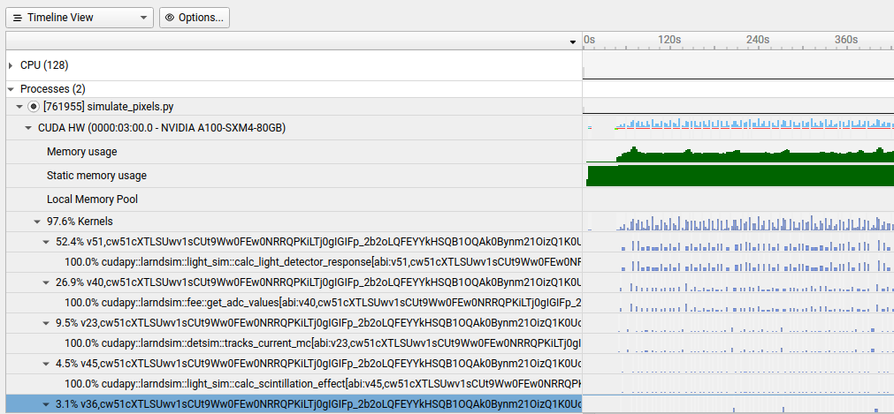

# larnd-sim example (Hackathon edition)

This is a minimal example for running [larnd-sim](https://github.com/DUNE/larnd-sim) on Perlmutter at NERSC. For the purposes of the hackathon, we also discuss running miniapps, profilers, tests, etc.

## Installation

Note: CFS and `$HOME` tend to struggle with Python virtual environments, so I recommend that you do the following steps in a directory on `$PSCRATCH` (but commit/push any code changes that you don't want to fall victim to `$PSCRATCH`'s purge policy!).

Start by cloning and entering this repository:

``` bash
git clone -b hackathon2024 https://github.com/lbl-neutrino/larnd-sim-example.git
cd larnd-sim-example
```

Then run the installer:

``` bash
./install_larnd_sim.sh
```

This will locally clone `larnd-sim` and create a Python virtual environment `larnd-sim.venv` for its dependencies. Since `larnd-sim` is installed with the `-e` option to `pip install`, you don't need to re-run `pip install` after modifying the code.

## The wrapper script

For convenience, we wrap all invocations of the simulation and miniapps in the `run.sh` wrapper script, which takes care of environment setup, profiling, etc.

## Running the full simulation

It's a good idea to grab a dedicated 80GB GPU:

``` bash
salloc -A dune -q interactive -C 'gpu&hbm80g' -t 30
```

30 minutes should be enough for a full run of `larnd-sim`. The above will actually give you a whole node, with four GPUs, which is more than you need, but so be it. You can also grab a single GPU on a shared node:


``` bash
salloc -q shared -C 'gpu&hbm80g' -t 30 --gpus-per-task 1 --ntasks 1 -A dune_g
```

But the `shared` QOS typically will leave you waiting in the queue, while `interactive` is usually nearly instant.

Once you've got a GPU to yourself, launch the simulation:

``` bash
./run.sh ./larnd-sim.sh
```

The output file will show up in `$SCRATCH/larnd-sim-output`.

### Controlling the run

The following environment variables can be used:

- `LARNDSIM_CONFIG`: Sets the configuration of the simulation (as defined in `larnd-sim/larndsim/config/config.yaml`). The default is `2x2`. For production we typically use `2x2_mod2mod_variation`.
- `LARNDSIM_MAX_EVENTS`: Can be used to limit the number of events simulated.
- `LARNDSIM_PROFILER`: Can be set to `nsys` or `ncu` to run in Nsight Systems or Nsight Compute, respectively
- `LARNDSIM_INPUT_FILE`: Can be used to override the default input file.
- `LARNDSIM_DISABLE_CUPY_MEMPOOL`: Disable the Cupy memory pool (recommended for using Nsight Systems to analyze memory use)
- `LARNDSIM_MINIAPP_NUM_RUNS`: Number of times to run a miniapp's CUDA kernel (default: 10)

Another parameter of interest is the `BATCH_SIZE` variable in the simulation properties file (e.g. `larnd-sim/larndsim/simulation_properties/2x2_NuMI_sim.yaml`). A smaller batch size can reduce peak memory usage but may degrade the realism of the simulation.

### Producing miniapp inputs

The following environment variables will cause larnd-sim to dump the kernel's input arrays to a pickle file (and then exit).

- `LARNDSIM_DUMP4MINIAPP_CALC_LIGHT_DET_RESPONSE`
- `LARNDSIM_DUMP4MINIAPP_GET_ADC_VALUES`
- `LARNDSIM_DUMP4MINIAPP_TRACKS_CURRENT_MC`

## Validating the output

Run `larnd-sim/cli/compare_files.py` to compare the simulation's output to a known good output. Good for verifying that any refactoring or optimization hasn't affected the output.

You can also produce a PDF of validation plots as follows:

```
./make_plots.sh /path/to/output.hdf5
```

The PDF file will be produced in the same directory as the HDF5 file.

## Running miniapps

Each of these miniapps supports the option `--output-file`, which can be used to specify the name of a pickle file for the output of the (first run of the) kernel. These outputs can be compared using `larnd-sim/cli/compare_miniapp_output.py`.

### `calc_light_det_response`

This kernel takes up some 50% of the runtime in a nominal simulation.

``` bash
./run.sh larnd-sim/miniapps/calc_light_det_response.py
```

### `get_adc_values`

This one takes up about 25%.

``` bash
./run.sh larnd-sim/miniapps/get_adc_values.py
```

### `tracks_current_mc`

This one's about 10%. (Note: The miniapp is running faster than expected. Need to verify that inputs are representative of the full simulation.)

``` bash
./run.sh larnd-sim/miniapps/tracks_current_mc.py
```

## Using the profiling output

After setting the `LARNDSIM_PROFILER` environment variable to `nsys` or `ncu` and running the simulation (or a miniapp), the profiling output will be available in `$SCRATCH/larnd-sim-output/nsys`. This output can be copied to your machine and inspected in the appropriate GUI, as follows:

### Nsight Systems

The output (an `nsys-rep` file) can be opened with `nsys-ui` from Nsight Systems 2023.4.1:



### Nsight Compute

The output (an `ncu-rep` file) can be opened with `ncu-ui` from Nsight Compute 2024.1.
